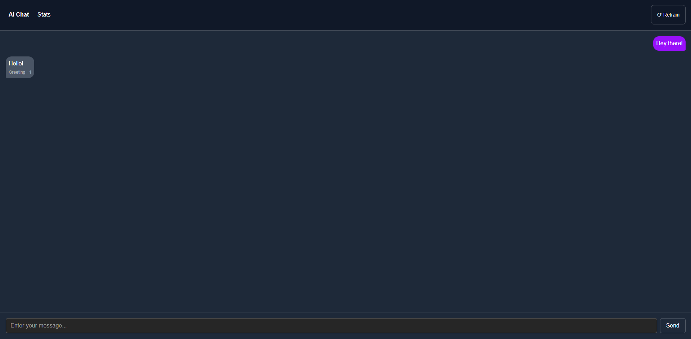
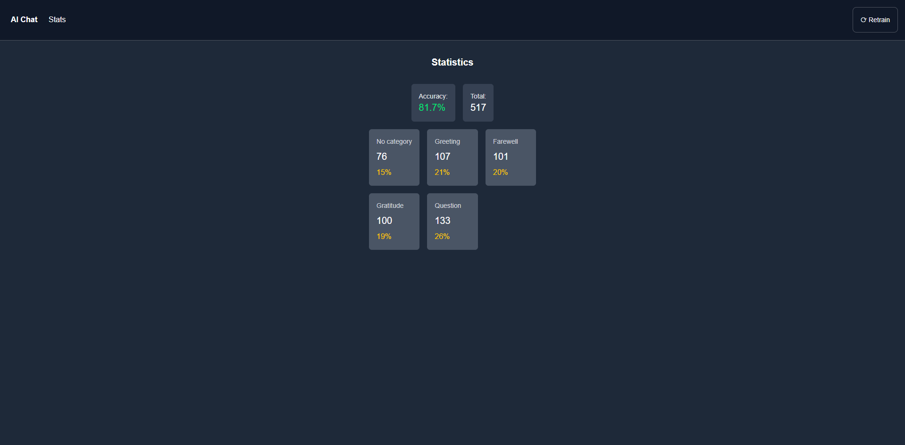

# AI Chat
 
A full-stack AI chat application that classifies user messages into intents using a machine learning model.
 
🔗 **Live Demo:** https://ai-chat-umber-pi.vercel.app/
 

 
## Built with
 
- Next.js 15
- TypeScript
- Tailwind CSS
- FastAPI
- scikit-learn (TF-IDF + MLPClassifier)
  
## Features
 
- Real-time message classification into intents (greeting, farewell, gratitude, question)
- Confidence score displayed for each bot response
- Manual intent correction — reassign any message to the correct category directly from chat
- Statistics page with model accuracy and dataset breakdown per intent
- Model retraining via UI button without redeployment
- Train/test split for honest accuracy evaluation
  

 
## Getting Started
 
### Backend
 
```
pip install -r requirements.txt
uvicorn main:app --reload
```
 
### Frontend
 
```
cd frontend
npm install
npm run dev
```
 
### Environment Variables
 
**Frontend** — create `frontend/.env.local`:
```
NEXT_PUBLIC_API_URL=http://localhost:8000
```
 
**Backend** — set environment variable:
```
FRONTEND_URL=http://localhost:3000
```
